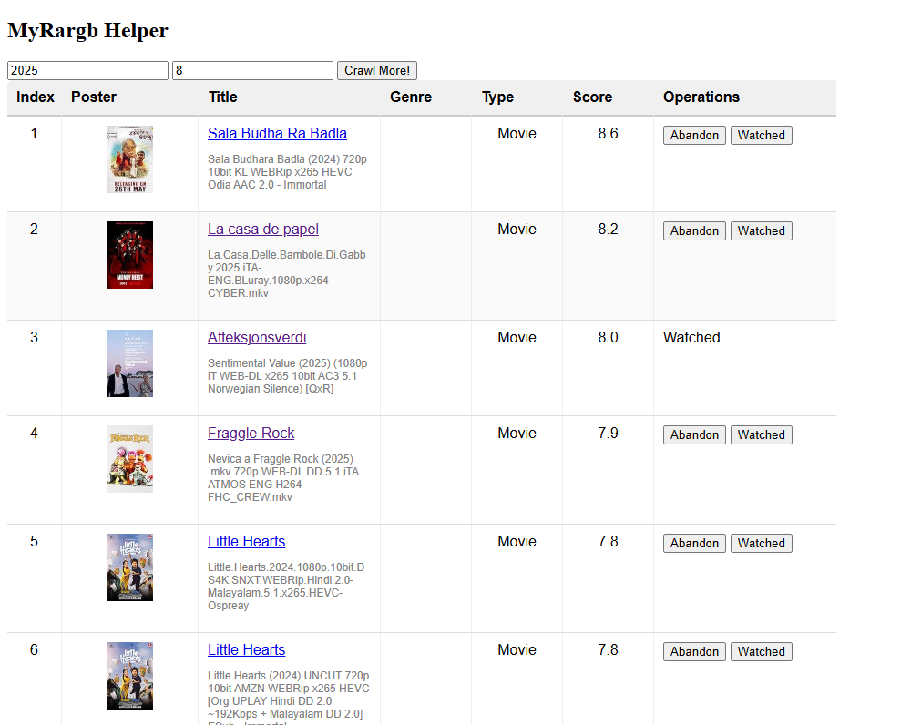

# MyRargb



[Rargb](https://rargb.to/) is a resource sharing site. I often download movies and TV shows there, but the site has no posters, no ratings, and many duplicate entries across resolutions/sources.

MyRargb fixes that:

1. **Crawl** — browses the rargb.to `/movies/` catalog via Playwright
2. **Extract** — uses a fine-tuned [T5-small](https://huggingface.co/google-t5/t5-small) model to extract clean movie titles from noisy filenames (e.g., `The.Matrix.1999.1080p.BluRay.x264-YTS` → `The Matrix`)
3. **Deduplicate** — Bloom filter catches duplicate movies across different resolutions/sources
4. **Enrich** — fetches poster, score, and genre from IMDb
5. **Browse** — clean web UI with poster images, scores, and mark-as-watched/abandoned

## Usage

```bash
# Install dependencies
uv sync

# Run the app (Kafka + browser not required for UI-only use)
uv run python app.py

# Full stack with Kafka for async pipeline
docker compose up --build
```

Open `http://localhost:5000`. Click **Crawl RARGB!** to start an incremental crawl.

## Environment

Copy `.env.example` to `.env` and adjust:

| Variable | Default | Purpose |
|---|---|---|
| `CHROME_URL` | `http://localhost:4444/wd/hub` | Selenium remote driver (unused; Playwright is default) |
| `DEBUG` | `false` | Flask debug mode |
| `LOGGER_LEVEL` | `INFO` | Log level |
